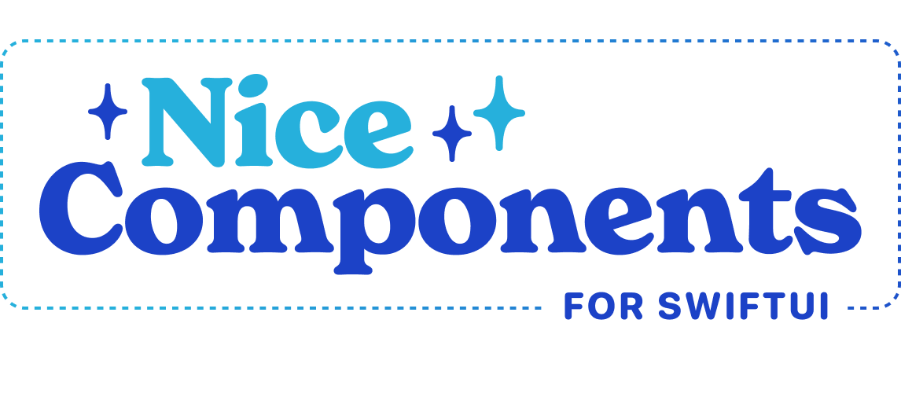

NiceComponents is a simple library with some nice looking SwiftUI components to get your next project started. 🚀

Jumpstart your prototypes with some sensible default components, then come back later and customize the look and feel of your app exactly how you want – all in one place.


## Usage

### Example Project

You can clone and run the example project to see examples of all the default components, plus a little sample of a more customized sign in screen, and demos of how to customize each component.

### Prototyping

When you're just starting out with your project, you should be able to get some reasonable results by just dropping in our components straight out of the box.

NiceComponents are made up of a couple fundamental pieces:
- **Components** are the Views you'll construct and the bits that your users will see, like `NiceButton` or `NiceText`.
- **Styles** are the set of colors, fonts, etc that describe a specific components, like a Primary button or some Detail text.
- **Themes** are interfaces that describe a set of colors, fonts, etc needed to describe a component.

```swift
import NiceComponents

struct DemoView: View {
    var body: some View {
        NiceText("I'm a nice big title!", style: .screenTitle)
        
        NiceButton("And I'm a nice little button", style: .primary) {
            doTheThing()
        }
    }
}
```

We provide the following text and button styles to get you started:


### Customizing Components

Once you're ready to start putting your own touch on components, you've got a couple options, based on how much you'd like to change.

#### Setting a Global Config at Startup

If you'd like to change _all_ instances of a component, or change global variables like your ColorTheme or ColorStyle we recommend creating a custom config that you can set when your app first starts. Note that you once you've set this config once, you'll be unable to update it.

In the case of multiple customizations applying to the same component, the _most specific_ one will take precedence.

```swift
import NiceComponents

@main struct ExampleApp: App {
   init() {
        var newConfig = Config()
       
       newConfig.bodyTextStyle = NiceTextStyle(
           color: Color(hex: "FFA71A"),
           size: 16
       )
       Config.current = newConfig
   }
}
```

#### Extending an Existing Component

If you want to create a new component, or extend an existing one, all you need to do is add a new Style:

```swift
extension NiceTextStyle {
    static var bodyBold: NiceTextStyle {
        Config.current.bodyTextStyle
            .with(weight: .bold)
    }
}

```

#### Customizing a Single Instance of a Component

If you just need to change something for a one-off UI element, each Style comes with a handy mutator function to allow you to customize it.

```swift
    NiceText(
        "Customize it with `with`", 
        style: .body.with(weight: .semibold)
    )

    NiceText(
        "Customize it with `with`", 
        style: NiceTextStyle(
            color: Color(hex: "FFA71A")
            with: .body,
            font: "Impact",
            size: 20
        )
    )
}

```

### Setting a Color Palette

In addition to being able to customize or extend each of the pre-set styles provided by NiceComponents, we provide two ways to change your color palette.

You can set a ColorTheme and/or ColorStyle when you create your custom Config by passing them into the constructor.


#### ColorTheme

Of the two options, ColorTheme is the more general option, allowing you to change colors that are applied to a variety of different components and places at once. The naming and usage here is indluenced heavily by the [wonderful Material Design palettes](https://m2.material.io/design/color/the-color-system.html).

ColorTheme takes the colors declared in your asset catalog and gives them a semantic meaning not tied to specific UI elements. 

We recommend declaring your colors in an Asset Catalog and pulling them in from there to make supporting light and dark mode a breeze. 

#### ColorStyle

ColorStyle describes the colors applied to all components by default semantically, changes here will take precedence over changes made to a ColorTheme, though will default to your ColorTheme if not specified.

In most cases, you'll probably be fine just changing your ColorTheme and allowing those changes to cascade into the different UI elements, but if you need a little more control over what colors things like specific buttons are, this is your place to do it.

#### Customizing your TextStyle

If you want to globally change the font in your app, you can change the Config's textStyle, and all the preset styles will respect your new styling.

Note that only `bodyText` will use the default `textStyle` size and weight.


### Installation

NiceComponents is available through **[Swift Package Manager](https://swift.org/package-manager/)**. To install it, follow these steps:

1. In Xcode, click **File**, then **Swift Package Manager**, then **Add Package Dependency**
2. Choose your project
3. Enter this URL in the search bar `git@github.com:steamclock/niceComponents.git`

#### Building with CI

Since NiceComponents uses some macros to automatically generate initializers for some classes, you may need to add `-skipMacroValidation` to your `xcodebuild` call to make it work.

### Migrating from Nice Components 1.0

Given the size and scope of changes from Nice Components 1 to 2, migrating may be a somewhat big process. The good news, a lot of that work can be done with good ol' Find and Replace.

To migrate, you'll want to:
1. Change any references to Components like PrimaryButton, BodyText, etc to use NiceText and NiceButton
2. Change any custom Components you've created into custom styles, extending either NiceTextStyle or NiceButtonStyle
3. Update your Config to use the new NiceButtonStyle and NiceTextStyles.

