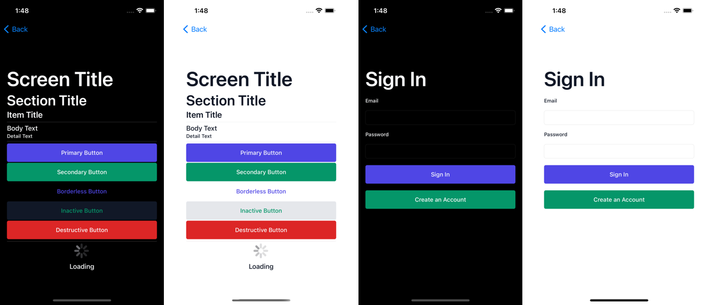

NiceComponents is a simple library with some nice looking SwiftUI components to get your next project started. 🚀

Jumpstart your prototypes with some sensible default components, then come back later and customize the look and feel of your app – all in one place.



## Usage

### Example Project

You can clone and run the example project to see examples of all the default components, plus a little sample of a more customized sign in screen.

### Straight Out of the Box

When you're just starting out with your project, you should be able to get some reasonable results by just dropping in our components straight out of the box.

```swift
import NiceComponents

struct DemoView: View {
    var body: some View {
        ScreenTitle("I'm a nice big title!")
        
        PrimaryButton("And I'm a nice little button") {
            doTheThing()
        }
    }
}

```

### Customizing Components

Once you're ready to start putting your own touch on components, you've got a couple options, based on what you'd like to change.

#### Setting a Global Config at Startup

If you'd like to change _all_ instances of a component, we recommend creating a custom config that you can set when your app first starts. Note that you once you've set this config once, you'll be unable to update it.


In the case of multiple customizations applying to the same component, the _most specific_ one will take precedence.

```swift
import NiceComponents

@main struct ExampleApp: App {
   init() {
       var newConfig = Config()
       newConfig.primaryButtonStyle = NiceComponents.ButtonStyle(
           surfaceColor: Color.red,
           onSurfaceColor: .black
       )
       Config.current = newConfig
   }
}
```

#### Extending an Existing Component

```swift
public struct CustomPrimaryButton: View {
    let text: String
    let onClick: () -> Void
    
    var body: some View {
        PrimaryButton(
            text,
            style: NiceButtonStyle(
                fontStyle: FontStyle(size: 16),
                surfaceColor: .red,
                onSurfaceColor: .black
            )
            onClick: onClick
        )
    }
}
```

#### Customizing a Single Instance of a Component

```swift
var body: some View {
   // ...
   
   PrimaryButton(
      "Tap me!",
       style: NiceComponents.ButtonStyle(
            fontStyle: FontStyle(size: 16),
            surfaceColor: .red,
            onSurfaceColor: .black
       )
   ) {
      print("I've been tapped!")
   }
})
   
   // ...
}

```

### Setting a Color Palette

Components are colored using a theme inspired by the [Material Design color system](https://material.io/design/color/the-color-system.html#color-theme-creation).

| Component | Text Color | Background Color |
| ------------- | ------ | ------------ |
| Primary Button | onPrimary  | primary  |
| Secondary Button |  onSecondary | secondary |
| Inactive Button | background | secondary |
| Destructive Button | onError | error |
| Body Text | onSurface | n/a |
| Detail Text | onSurface | n/a |

We also recommend declaring your colors in an Asset Catalog to make supporting light and dark mode a breeze. 

```swift
import NiceComponents

@main struct ExampleApp: App {
   init() {
       var newConfig = Config()
       newConfig.colorTheme = ColorTheme(
        primary: Color("theme_primary"),
        onPrimary: Color("theme_onPrimary)"
       )
       Config.current = newConfig
   }
}
```

#### Setting a Custom Font 

Just like how you can set a `colorTheme`, you can also set a `fontStyle` that defines the default font, size and weight for all components.

| Component | Type Name |
| ------------- | ------ | 
| Primary Button | button | 
| Secondary Button |  button | 
| Inactive Button | button | 
| Destructive Button | button | 
| Body Text | body | 
| Detail Text | detail | 

```swift
    var newConfig = Config()
    newConfig.primaryButtonStyle.fontStyle = FontStyle(
        "Comic Sans MS",
        size: 16,
        weight: .semibold
    )
    Config.current = newConfig
```

### Installation

NiceComponents is available through **[Swift Package Manager](https://swift.org/package-manager/)**. To install it, follow these steps:

1. In Xcode, click **File**, then **Swift Package Manager**, then **Add Package Dependency**
2. Choose your project
3. Enter this URL in the search bar `git@github.com:steamclock/niceComponents.git`
